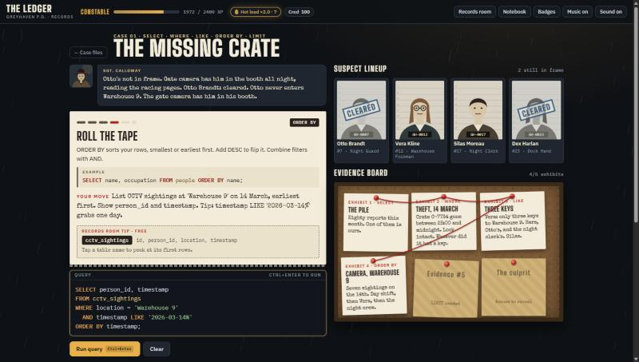

# The Ledger

**A noir detective game that teaches SQL.** You are a rookie detective in Greyhaven, a rain-soaked port city. Thefts, fake invoices and one disappearance all trace back to a mastermind known only as *The Ledger*. You solve cases by querying the city's records database, and every query you write is real SQL running against a real SQLite database in your browser.



It is one HTML file. No build step, no backend, no accounts. Open it and play.

## Play

**Online:** https://moneyshotx420.github.io/the-ledger-sql-detective/

**Locally:** open `index.html` in a modern browser. It needs an internet connection the first time, because it loads the SQL engine (sql.js) and the fonts from public CDNs.

If anything fails to load when opened as a plain file, serve the folder instead:

```bash
npx serve .
```

Works on desktop and phone. Progress is saved in your browser, so use the same browser to continue.

## What you get

| | |
|---|---|
| **Real SQL** | Any valid `SELECT` or `WITH` query runs on SQLite (sql.js). Answers are checked by comparing result sets, not by matching your query text, so there are many correct ways to solve each step. |
| **Free table tip** | Every lead names the table(s) you need and lists their columns. Tap a table name to peek at its first rows. |
| **Three paid hints** | A nudge, then the keyword, then a partial query. Each costs a little XP. |
| **Red herrings** | Common mistakes (missing date filter, wrong join column, `LIKE` without `%`) return a plausible but wrong answer. Your partner explains what you missed. |
| **Near-miss feedback** | When you are close, your result is shown next to the expected shape, with the rows that do not belong marked in red. |
| **Plain-English errors** | SQL errors are translated into your partner's voice. |
| **Evidence board** | Each correct query pins a clue card to a corkboard. Red string links related clues. |
| **Suspect lineup** | Suspects start as photos and get stamped CLEARED as your evidence rules them out. |
| **The accusation** | End each case by choosing the culprit and backing it with a query. A wrong name costs credibility. |
| **Progression** | XP, a hot-lead streak multiplier, five ranks with promotion screens, 1 to 3 stars per case, and badges. |
| **XP pop-out** | Solving a lead pops a spinning 3D coin out of the "+N XP" total. It flies to the rank bar with mini coins behind it, and the bar and your XP count up when it lands. |
| **SQL Academy** | 14 short lessons with examples you can edit and run, the common slips with a "see what happens" button, and a practice question that checks your answer. Studying every lesson earns a badge. |
| **Notebook** | Every query you solve is saved so you can reuse it. |
| **Records room** | A drawer listing every table, its columns and a live row preview, available at any time. |
| **Atmosphere** | Falling rain, a folder that flips open, a case-closed stamp with a thud and screen shake, typewriter clacks, a synthesised noir jazz loop, and little 3D touches: cards, suspects and tiles lean toward your pointer, evidence cards flip, pins drop, stamps tilt in, and rank insignia spin. |

## How to play

1. Pick a case on the home screen and open the folder. Read the briefing.
2. Each case has 5 leads. Each lead teaches one idea, shows an example, then asks you to write one query.
3. Press **Run query** or **Ctrl+Enter** (Cmd+Enter on Mac).
4. Right answer: a clue is pinned, suspects may be cleared, and **Next lead** appears.
5. After the last lead, tap a suspect in the lineup, write a query that proves it, and press **Accuse**.

Tips:
- **Academy** (top bar) opens the SQL lessons. Inside a lead, the topic chip at the top right of the card (for example `WHERE ↗`) jumps straight to that lesson.
- **Records room** (top bar) shows all 11 tables at any time.
- **Notebook** reloads any query you solved earlier.
- **Music** and **Sound** buttons in the top bar. *Sound* mutes everything, *Music* only the background loop. Audio starts after your first click or key press.
- Only read-only queries run. `INSERT`, `UPDATE`, `DELETE`, `DROP` and friends are refused, so you cannot break the city.

### Cases

| # | Case | SQL skills | Status |
|---|---|---|---|
| 1 | The Missing Crate | `SELECT`, `WHERE`, `LIKE`, `ORDER BY`, `LIMIT` | Playable |
| 2 | The Broken Alibi | `COUNT`, `GROUP BY`, `HAVING`, `AVG`, `SUM` | Playable |
| 3 | The Getaway Car | `INNER JOIN`, `LEFT JOIN` across 2 to 4 tables | Planned |
| 4 | The Paper Trail | subqueries, `CASE WHEN`, date ranges | Planned |
| 5 | The Ledger | CTEs, window functions | Planned |

Stuck? A full walkthrough with every solution is in [docs/WALKTHROUGH.md](docs/WALKTHROUGH.md). It contains spoilers.

## Scoring

**XP per lead**

| Part | Amount |
|---|---|
| Lead solved | +100 |
| First try (no wrong result, no error) | +40 |
| Speed (under 90 seconds) | +20 |
| No hints | +20 |
| Hints used | −10, −20, −30 for tiers 1, 2, 3 |

The total (minimum 20) is multiplied by your **hot-lead streak**: `×(1 + 0.2 × (streak − 1))`, capped at ×2.0. The streak grows by one for every lead solved and every case closed. It resets on a wrong result, a red herring, or a wrong accusation. Syntax errors do not reset it. The streak also resets each time you reload the page.

Replaying a lead you already solved earns 25% XP.

**Accusation:** 150 XP, +50 if you made no wrong accusations in the case, times the streak multiplier.

**Stars per case**

- ★ Close the case
- ★★ and make no wrong accusations
- ★★★ and use one hint or fewer (the free table tip does not count)

**Credibility** starts at 100. A wrong accusation costs 20. Closing a case with no wrong accusations restores 10. Credibility is a record of your reputation shown in the top bar. It does not block play.

**Ranks**

| Rank | XP needed |
|---|---|
| Rookie | 0 |
| Constable | 600 |
| Detective | 2,400 |
| Inspector | 4,500 |
| Chief Inspector | 7,500 |

**Badges (14):** First Lead, Hot Lead, Quick Draw, Red Herring Hunter, Clean Accusation, By the Book, Perfect Record, No Stone Unturned, Top of the Class (study all 14 Academy lessons), Case Cracker, Count On Me, plus Join Master, Paper Pusher and Unmasked, which are reserved for the cases still to come.

The Academy awards no XP, so it cannot be used to farm ranks. Your practice answers are checked with the same result-set comparison as the cases.

## The city's records

Eleven tables, 55 to 147 rows each, generated from a fixed seed (`314159`) so every player sees the same city. The real clues are hidden among plenty of innocent records, so filtering matters.

| Table | Columns | Rows |
|---|---|---|
| `people` | id, name, address_id, occupation, phone, account | 120 |
| `addresses` | id, street, district | 80 |
| `vehicles` | plate, make, colour, owner_id | 72 |
| `phone_calls` | id, caller, receiver, timestamp, duration (seconds) | 147 |
| `bank_transactions` | id, from_account, to_account, amount, date | 136 |
| `cctv_sightings` | id, person_id, location, timestamp | 128 |
| `crime_reports` | id, date, type, location, description | 80 |
| `interviews` | id, person_id, transcript | 55 |
| `warehouse_inventory` | item_code, description, warehouse, quantity, status | 80 |
| `shipments` | id, item_code, vessel, origin, destination, ship_date, status | 60 |
| `invoices` | id, vendor, client, description, amount, date, signed_by | 60 |

`phone` and `account` on `people` are an addition to the minimal schema. They let calls and payments be traced back to a person.

Dates and timestamps are text in ISO form (`'2026-03-14 23:12'`), which sorts and compares correctly as text.

## How it works

Everything lives in `index.html`, in this order: styles, markup, then one script.

| Section of the script | What it does |
|---|---|
| Helpers and seeded RNG | `rng(seed)` is a small deterministic generator. |
| `buildData()` / `buildDB()` | Generates all rows, creates the tables in an in-memory sql.js database, and inserts the rows. |
| `CASES` | All story text, steps, expected queries, red herrings, clues and accusation rules. This is the content you edit to add a case. |
| Save state | `localStorage` under the key `ledger-casebook-v1`. A save that is missing newer fields is healed on load, and an unreadable save falls back to a fresh start. |
| `Sound` and `Music` | Web Audio. Every sound effect and the music loop (bass, soft electric piano, a sparse vibraphone melody, brush drums, a short echo) are synthesised, so there are no audio files. Audio starts only after your first click or key press. |
| SQL helpers | `runSQL` (results are capped at 5,000 rows and flagged as `truncated`), the answer comparison (`matchResult`, `diffResult`), the error translator, the syntax highlighter. |
| XP system | `addXP` saves the XP at once. `xpBurst` plays the coin animation with the Web Animations API, and `settleXP` counts the top bar up when the coin lands (immediately if you prefer reduced motion). |
| Pointer tilt | One small listener. Any element with `data-tilt="degrees"` leans toward a mouse pointer through the CSS variables `--rx` and `--ry`. It is skipped for touch and reduced motion. |
| Screens | Home, case screen, step card, lineup, evidence board, folder overlay, promotion overlay, drawers. |
| SQL Academy | `ACADEMY` (the lessons), `CONCEPT_LESSON` (which lead topic opens which lesson) and the drawer UI. See [docs/ACADEMY.md](docs/ACADEMY.md). |
| `__selfTest()` | A built-in content checker (see Testing). |

### How answers are checked

`matchResult(user, expected, ordered)` compares result sets:

- Column **names** are ignored, so aliases are fine.
- **Extra columns** are allowed (`SELECT *` solves most steps).
- Row **order** only matters on steps marked `ordered: true`.
- Numbers are rounded to 2 decimals and text is compared case-insensitively.

If your result does not match, it is compared against each step's listed red herrings. A match shows a targeted explanation. Otherwise you get the near-miss view.

### Accusations

An accusation passes when all of these hold: you chose the real culprit, your query returns rows, the query touches the evidence table the case requires (for example `cctv_sightings` in Case 1), every row mentions the culprit by id, name, phone or account, and no row mentions another suspect.

### Safety

Only read-only queries run. Statements containing `INSERT`, `UPDATE`, `DELETE`, `DROP`, `CREATE`, `ALTER`, `ATTACH`, `PRAGMA`, `BEGIN`, `COMMIT` and similar are refused. `RECURSIVE`, `RANDOMBLOB` and `ZEROBLOB` are also blocked, because the in-browser SQLite has no query timeout and those can freeze the tab. Only the first statement of a multi-statement query runs. The database lives in memory and is rebuilt on every page load.

## Testing

**Content self-test.** Open the browser console on the game and run:

```js
__selfTest()
```

It runs 273 checks. For the cases: every table has 50 to 150 rows, every step's expected query runs and returns rows, no red herring can be mistaken for a real answer, clue links point at real exhibits, every wrong suspect gets cleared by the evidence, the reference accusation is accepted, wrong suspects are rejected, and a bare name lookup is rejected as evidence. For the Academy: every example runs and returns rows, every practice answer is valid, no slip would be refused by the read-only guard, and every lead's topic links to a lesson. It logs `Self-test passed` or lists the failures. Run it after any change to `CASES`, `ACADEMY` or the data.

**UI checklist.** [docs/TESTING.md](docs/TESTING.md) lists every UI path that was exercised (home, briefing, query outcomes, hints, accusation, case-closed report, promotions, drawers, audio, save and restore, phone width).

**Reset your progress:**

```js
localStorage.removeItem('ledger-casebook-v1'); location.reload();
```

## Known limitations

- Needs an internet connection to load sql.js and the fonts (from cdnjs and Google Fonts).
- A deliberately huge cross join (a table joined to itself several times) can be slow, because the browser build has no query timeout. Results are cut off at 5,000 rows and shown as `5000+ rows`.
- The Academy teaches joins, subqueries, `CASE WHEN`, CTEs and window functions before their cases exist, so you can learn them early. Its practice questions give no XP.
- Cases 3 to 5, the daily cold case and a few badges are not built yet. See the roadmap.
- The music and sound effects are synthesised and have been checked for level and silence, but taste is personal. Use the Music button to turn it off.
- Progress lives in one browser. There is no cloud save.

## Roadmap

1. **Case 3, The Getaway Car:** joins across vehicles, people, addresses and cameras, with a wrong-join red herring that names the wrong owner.
2. **Case 4, The Paper Trail:** subqueries, `CASE WHEN` and date ranges on the Tidewater invoices and Edith Marlowe's last movements.
3. **Case 5, The Ledger:** CTEs and window functions (running totals, `RANK`, `LAG`) to find the account that always sits in the middle of the money, then unmask The Ledger.
4. **Daily cold case:** a short bonus mystery with data randomised from the date.
5. Review of solved steps, pinch-zoom on the evidence board, and a harder mode that hides the expected columns.
6. A short end-of-lesson quiz in the Academy with an XP reward the first time it is passed.

To add a case, read [docs/CASE-AUTHORING.md](docs/CASE-AUTHORING.md). To add or edit a lesson, read [docs/ACADEMY.md](docs/ACADEMY.md).

## Credits

Built with [sql.js](https://github.com/sql-js/sql.js) (SQLite compiled to JavaScript) and the Big Shoulders Display, IBM Plex and Special Elite typefaces from Google Fonts. All story, characters and data are fictional.

Licensed under the MIT License. See [LICENSE](LICENSE).
