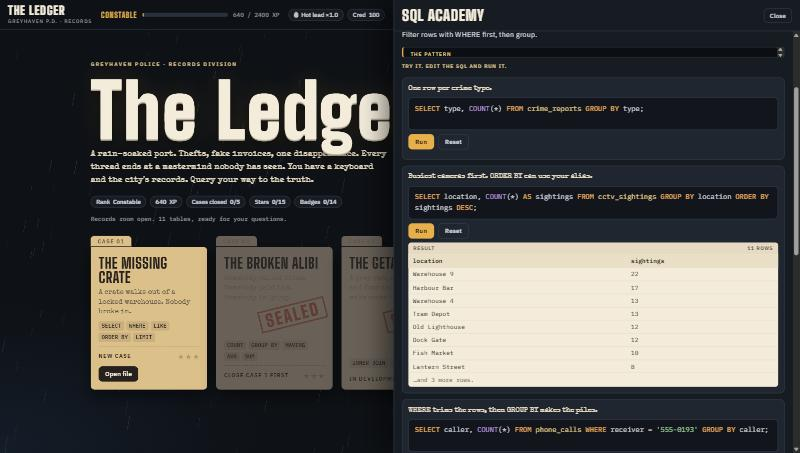

# SQL Academy



The Academy is a set of short lessons inside the game. It opens from **Academy** in the top bar, or from the topic chip on a lead (for example `WHERE ↗`), in a wide drawer so you never lose your place in a case.

Every lesson has the same parts:

1. A short plain-language explanation (two short paragraphs at most).
2. **The pattern**, a syntax skeleton.
3. **Try it**: two or three examples in a small editor. Edit the SQL, press **Run** (or Ctrl+Enter), and see the result.
4. **Common slips**: mistakes people really make. **See what happens** runs the broken query and shows the plain-English error or the misleading result.
5. **Your turn**: a practice question. **Check my answer** compares your result with the reference answer, using the same comparison as the cases.

A lesson counts as **studied** when you run one of its examples or pass its practice question. Studying all 14 awards the **Top of the Class** badge. The Academy gives no XP, so it cannot be used to farm ranks. Progress is saved with everything else.

## The lessons

| # | Lesson | Group | Used in |
|---|---|---|---|
| 1 | SELECT and FROM | Case 1 toolkit | Case 1, lead 1 |
| 2 | WHERE | Case 1 toolkit | Case 1, lead 2 |
| 3 | LIKE | Case 1 toolkit | Case 1, lead 3 |
| 4 | ORDER BY and LIMIT | Case 1 toolkit | Case 1, leads 4 and 5 |
| 5 | COUNT | Case 2 toolkit | Case 2, lead 1 |
| 6 | SUM, AVG, MIN, MAX | Case 2 toolkit | Case 2, leads 4 and 5 |
| 7 | GROUP BY | Case 2 toolkit | Case 2, lead 2 |
| 8 | HAVING | Case 2 toolkit | Case 2, lead 3 |
| 9 | INNER JOIN | Later cases | Case 3 (sealed) |
| 10 | LEFT JOIN | Later cases | Case 3 (sealed) |
| 11 | Subqueries | Later cases | Case 4 (sealed) |
| 12 | CASE WHEN and dates | Later cases | Case 4 (sealed) |
| 13 | CTEs (WITH) | Later cases | Case 5 (sealed) |
| 14 | Window functions | Later cases | Case 5 (sealed) |

The last six teach skills for cases that are not playable yet. They use the real city tables, so every example runs today.

## How the topic chip finds its lesson

`CONCEPT_LESSON` maps each lead's `concept` string to a lesson id:

```js
const CONCEPT_LESSON = {SELECT:'select', WHERE:'where', LIKE:'like', 'ORDER BY':'sort', LIMIT:'sort',
  COUNT:'count', 'GROUP BY':'groupby', HAVING:'having', AVG:'agg', SUM:'agg'};
```

When you add a lead with a new `concept`, add it here. `__selfTest()` fails if a lead's concept has no lesson.

## Lesson object

All lessons live in the `ACADEMY` array in `index.html`.

```js
{
  id:'where', group:0,                       // index into ACAD_GROUPS
  title:'WHERE', tag:'Keep only the rows that pass a test.',
  body:[ 'First paragraph.', 'Second paragraph.' ],
  syntax:"SELECT columns\nFROM table_name\nWHERE condition;",
  examples:[
    { sql:"SELECT name FROM people WHERE occupation = 'Pawnbroker';", note:'One line about what this shows.' },
    …                                        // at least two
  ],
  mistakes:[
    { sql:"SELECT name FROM people WHERE occupation = Pawnbroker;", why:'What goes wrong, and the fix.' },
    …                                        // at least two
  ],
  challenge:{
    task:'The practice question, in plain words.',
    expected:"SELECT name FROM people WHERE occupation = 'Pawnbroker'",   // the reference answer. Its RESULT is the answer.
    ordered:true,                            // optional: row order must match
    must:/\bwith\b/i, mustMsg:'Use a WITH clause for this one.',          // optional: the query text must match
    hint:'Shown after two wrong tries.',
  },
  usedIn:'Case 1, lead 2',
}
```

## Rules for good lessons

- **One idea per lesson.** Two short paragraphs, then examples. If you need more, make a second lesson.
- **Every example must return rows.** An empty result teaches nothing. The self-test enforces this.
- **Every slip must really behave as its `why` says.** The self-test cannot check this, so click **See what happens** and read it. Two things to watch for:
  - SQLite is forgiving. `SELECT name occupation FROM people` is not an error (it reads `occupation` as a nickname), and a bare column with an aggregate returns an arbitrary row. Say so honestly, and do not claim an error where there is none.
  - Make the slip show a visible difference. For an off-by-one slip, pick a number where `>` and `>=` give different rows (the HAVING lesson uses 9 for that reason).
- **Practice answers should be unambiguous.** The comparison ignores column names and allows extra columns, but it checks rows. Avoid questions where ties could reorder rows, unless the order does not matter. Use `must` when the point of the question is a keyword (`WITH`, `CASE`, `OVER`).
- **Use the real tables.** Examples that reference the investigation (Silas' phone `555-0193`, account `ACC-1093`) tie the lessons to the story.

## Where the code is

| Piece | Name in `index.html` |
|---|---|
| Lesson content | `ACADEMY`, `ACAD_GROUPS`, `CONCEPT_LESSON` |
| List and lesson views | `renderAcademy()` |
| Small highlighted editors | `miniShell()` and `syncMini()` |
| Run an example or a slip | `runLessonSQL()` (read-only guard, plain-English errors, 8-row preview) |
| Practice check | `checkChallenge()` (uses `matchResult`) |
| Progress and badge | `markStudied()`, saved in `S.academy` |

Everything is delegated from one click, input and keydown listener on the drawer body, so the views can be re-rendered freely.
