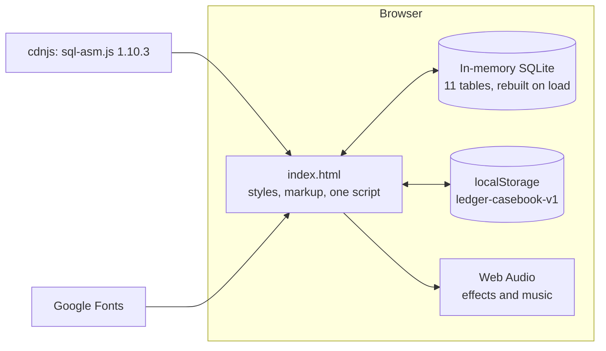
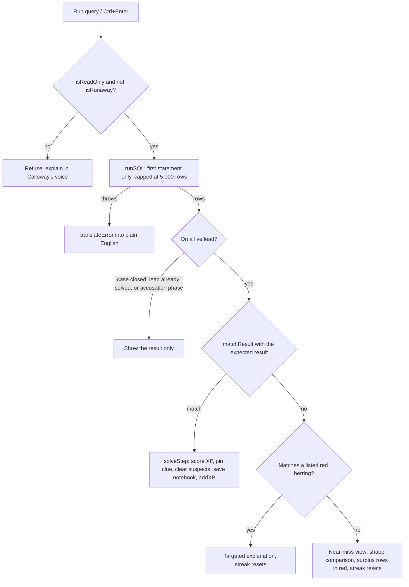

# Architecture

A tour of how The Ledger works, for anyone who wants to change it. For the player-facing description see the [README](../README.md). To add content, see [CASE-AUTHORING.md](CASE-AUTHORING.md) and [ACADEMY.md](ACADEMY.md).

## The big picture

The game is one static file, `index.html`. There is no server, no build and no framework.

Only two things are fetched from the network: the SQL engine and the fonts. Nothing about the player leaves the browser.

**Why the plain-JavaScript sql.js build?** The default build downloads a separate `.wasm` file at start-up. Some hosts, such as a page published as a claude.ai artifact, only allow script files from a short list of CDNs and block every other fetch. `sql-asm.js` is a single script with no extra download, so it works on all of them, at the cost of being somewhat slower than the WebAssembly build. That is fine for a database of a few hundred rows.

## Layout of `index.html`

The file is, in order: the stylesheet (colour tokens first), the markup for every screen and overlay, then one `<script>`. The script is organised in banner-commented sections, in this order:

| Section | What it holds |
|---|---|
| helpers | `$`, `esc`, `pad`, `wait`, and `rng(seed)`, a small deterministic random generator |
| THE CITY RECORDS | `PLOT` (the story people), `SCHEMA`, `TABLE_INFO`, `buildData()` and `buildDB()` |
| CASES | All story text, leads, expected queries, red herrings, clues, accusation rules, `RANKS`, `BADGES` |
| save state | `S`, `freshSave()`, `freshCase()`, `CS()`, `save()` |
| sound | `Sound` (effects) and `Music` (the background loop) |
| rain | The falling-rain canvas |
| SQL engine helpers | `strip`, `isReadOnly`, `isRunaway`, `runSQL`, `matchResult`, `diffResult`, `translateError`, `tablesIn` |
| syntax highlighting | `highlight()` and the main editor's overlay |
| portraits | `mugshot(id)` draws each suspect as an SVG |
| top bar, toasts, badges, XP | `renderTop`, `addXP`, `settleXP`, `xpBurst`, `award` |
| screens | `showHome`, `enterCase`, `renderStep`, `renderLineup`, `renderBoard`, hints |
| running queries | `runQuery`, `checkStep`, `solveStep`, `judgeAccusation`, `closeCase` |
| folder overlay | The briefing and the case-closed report |
| pointer tilt | The 3D tilt listener |
| SQL ACADEMY | `ACADEMY`, `CONCEPT_LESSON`, and the drawer UI |
| self-test | `__selfTest()` |
| boot | Loads the engine, builds the database, shows the home screen |

Line numbers are deliberately not listed here, because they change. Search the file for the banner text instead.

## How rendering works

There is no virtual DOM. Each screen is a function that builds an HTML string and assigns it to `innerHTML`, and the screen is rebuilt whenever its state changes (`renderStep()`, `renderLineup()`, `renderBoard()`, `renderAcademy()`).

Two rules keep this safe and simple:

- **Anything that came from the player is escaped** with `esc()` before it goes into a template. This covers queries, results, transcripts and saved notebook entries. Content written by the authors (`CASES`, `ACADEMY`) is trusted.
- **Events are delegated.** Each area has one listener on its container (for example `#drawerBody` or `#lineup`) that looks at `e.target.closest('[data-…]')`. Because nothing is bound to individual nodes, a screen can be re-rendered at any time.

## What happens when you run a query

Notes:

- A lead is **live** only while it is being worked on: not after it is solved (while **Next lead** is showing), not during the accusation, not once the case is closed. Errors and failures only count against a live lead. Messages produced while a solved lead is waiting go to a separate area so the **Next lead** button is never replaced.
- `matchResult` compares result **sets**. It ignores column names, allows extra columns, and only cares about row order on leads marked `ordered`. Numbers are rounded to two decimals and text is compared case-insensitively. It tries every way of lining up your columns with the expected ones.
- `diffResult` is used only for the near-miss view. It guesses which of your columns correspond to the expected ones, then marks rows that are not in the expected result.

## The accusation

`judgeAccusation(case, suspectId, sql, result)` returns `wrong`, `thin` (right person, evidence rejected, with a reason) or `ok`. For the right person it checks, in order: the result has rows; the query text matches the case's `evidence` pattern; no row mentions another suspect; every row mentions the culprit. `mentions()` recognises an id in `person_id` or `owner_id`, an `id` alongside a `name` column, and a name, phone number or account in text.

## State

Persistent state is one object, `S`, saved as JSON under `ledger-casebook-v1`:

| Field | Meaning |
|---|---|
| `xp`, `cred`, `streak`, `bestStreak` | Score, credibility and the hot-lead streak. The streak is reset to 0 on every page load. |
| `badges` | Ids of earned badges |
| `cases` | One record per case: `step`, `cleared`, `hints`, `wrongAcc`, `closed`, `started`, `bestStars`, `stepHints`, `stepFails`, `stepErrors`, `herring`, `queries`, `draft` |
| `notebook` | Solved queries, newest first |
| `tables` | Tables you have queried, for No Stone Unturned |
| `ever` | Keys of leads you have ever solved, so replays earn 25% XP |
| `academy` | Ids of studied Academy lessons |
| `muted`, `music` | Audio settings |

On load, a saved object is merged over the defaults, each case record is merged over a fresh one, and the array fields are checked, so a save from an older version still works. If the save cannot be parsed, a fresh one is used. If storage is blocked the game still plays and just does not save.

Short-lived state is a plain object, `cur`: the open case, when the lead started, whether the lead is waiting on **Next lead** (`pending`), the suspect being accused, and flags for what to animate on the next render. It is reset whenever a case is entered.

## Screens and layers

There are three kinds of surface: the home and case screens (`#homeScreen`, `#caseScreen`), the drawer (`#drawer`) used by the records room, notebook, badges and Academy, and the overlays (the case folder and the promotion screen).

Stacking order, from back to front:

| z-index | What |
|---|---|
| 0 | Rain canvas |
| 1 | `#app` (everything else on the page) |
| 20 | Sticky top bar |
| 60 | Folder overlay |
| 65 | Drawer |
| 70 | Promotion overlay |
| 90 | Toasts |
| 94 to 95 | XP coin, mini coins and hint labels |

Hidden elements use the `hidden` attribute. The stylesheet makes `[hidden]` win over any `display` rule.

## Motion

- **Evidence card flip** is a CSS 3D transform on an inner element. The pointer tilt is applied to a wrapper around it, so the two do not fight.
- **Pointer tilt.** Any element with `data-tilt="maxDegrees"` leans toward a mouse pointer. One `pointermove` listener on the document finds the element and sets the CSS variables `--rx` and `--ry` (and `--gx`, `--gy` for the glare). The `.t3` class turns those variables into a `perspective()` transform. It ignores touch and pens, skips sealed tiles, and is not installed at all if the user prefers reduced motion.
- **XP coin.** `addXP` saves the XP immediately and starts `xpBurst`, which animates a 3D coin and mini coins with the Web Animations API. The top bar shows `xpShown`, which only catches up to `S.xp` when the coin lands (`settleXP` tweens it). A timeout settles it anyway after a few seconds in case an animation never finishes. With reduced motion there is no coin and `settleXP` runs at once.
- A global `prefers-reduced-motion` rule shortens every CSS animation and transition to almost nothing.

## Audio

Everything is synthesised with the Web Audio API. There are no audio files.

- `Sound` makes the effects (typewriter clacks, shuffles, thud, ding, pin, coin). The `AudioContext` is created on the first `pointerdown` or `keydown`, because browsers do not allow sound before that.
- `Music` is a lookahead scheduler. Every 120 ms it schedules the next eighth-notes on the audio clock, about 0.7 seconds ahead, so timing stays steady even if the page stalls. The loop is 8 bars at 64 bpm, two chords per bar (Am9, Dm9, Bm7b5, E7b9 and Fmaj7). Each step can play the bass, a swelling pad, a soft electric-piano comp, a sparse vibraphone melody note chosen from the current chord, a light brush on every eighth note, and a snare brush on beats 2 and 4. A short feedback delay adds space. There is no continuous noise under it.
- **Sound** (everything) and **Music** (the loop only) are separate settings. Audio is suspended while the tab is hidden.

## The Academy

Lessons are data (`ACADEMY`), and one function, `renderAcademy()`, draws either the lesson list or one lesson. The small editors reuse the same highlighter as the main editor (`highlight`) through `miniShell()` and `syncMini()`. Running an example uses `runLessonSQL`, which applies the same read-only guard and error translation as the main game. A practice question is checked by `checkChallenge`, which uses `matchResult`, so there are many correct answers. See [ACADEMY.md](ACADEMY.md).

## Safety model

- **Read-only.** `isReadOnly` rejects statements containing `INSERT`, `UPDATE`, `DELETE`, `DROP`, `CREATE`, `ALTER`, `ATTACH`, `DETACH`, `PRAGMA`, `VACUUM`, `REINDEX` and transaction keywords, after string literals and comments have been stripped, so a keyword inside a quoted string does not trigger it. `REPLACE INTO` is rejected, but the `REPLACE()` function is allowed.
- **Runaway queries.** `isRunaway` rejects `RECURSIVE`, `RANDOMBLOB` and `ZEROBLOB`. The in-browser SQLite has no timeout, so these could freeze the tab. A huge self-join can still be slow.
- **Only the first statement runs**, because the engine prepares one statement at a time.
- **The database is disposable.** It lives in memory and is rebuilt on every load.
- See [SECURITY.md](../SECURITY.md) for the reporting policy and known hardening gaps.

## Design decisions

| Decision | Why |
|---|---|
| One file, no build | Anyone can read, fork and host it. The whole game can be shared as a single attachment or a single Pages file. |
| Compare result sets, not query text | There are many correct ways to write a query. Checking the answer rewards understanding, not memorising. |
| Seeded data | Every player sees the same city, so clues, counts and the walkthrough are stable and testable. |
| Red herrings are real queries | The wrong answers come from running real mistaken queries, so the explanation always matches what the player saw. |
| A built-in self-test | Content is easy to break quietly (a count in a clue, a herring that equals the answer). `__selfTest()` catches that in a second. |
| Plain DOM templates | The UI is small. A framework would be more code than it saves, and a build step would end the one-file property. |

## Extending

| To | Read |
|---|---|
| Add or change a case, lead or clue | [CASE-AUTHORING.md](CASE-AUTHORING.md) |
| Add or change an Academy lesson | [ACADEMY.md](ACADEMY.md) |
| Check your change | [TESTING.md](TESTING.md) |
| Open a pull request | [CONTRIBUTING.md](../CONTRIBUTING.md) |
